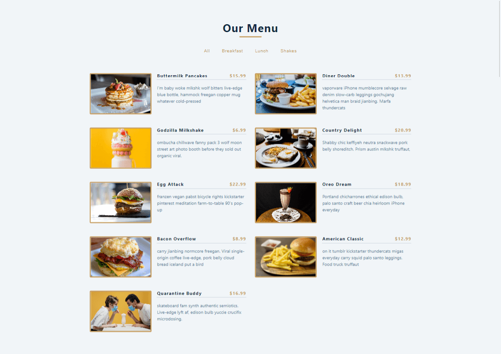
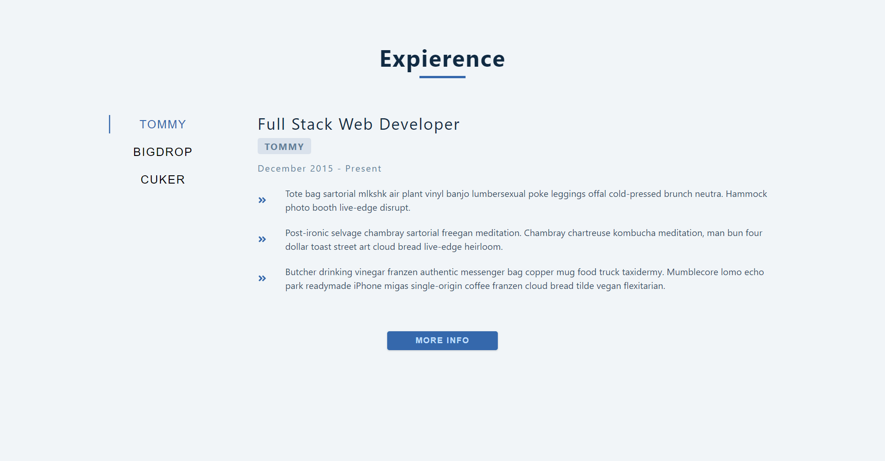
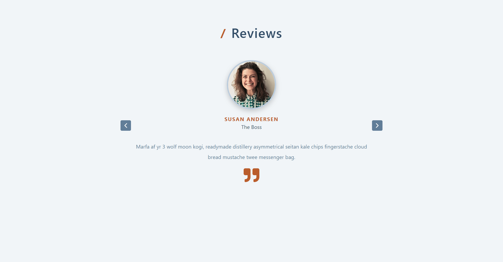

<!--
*** Thanks for checking out the Best-README-Template. If you have a suggestion
*** that would make this better, please fork the repo and create a pull request
*** or simply open an issue with the tag "enhancement".
*** Thanks again! Now go create something AMAZING! :D
-->


<!-- PROJECT SHIELDS -->
<!--
*** I'm using markdown "reference style" links for readability.
*** Reference links are enclosed in brackets [ ] instead of parentheses ( ).
*** See the bottom of this document for the declaration of the reference variables
*** for contributors-url, forks-url, etc. This is an optional, concise syntax you may use.
*** https://www.markdownguide.org/basic-syntax/#reference-style-links
-->
[![Contributors][contributors-shield]][contributors-url]
[![Forks][forks-shield]][forks-url]
[![Stargazers][stars-shield]][stars-url]
[![Issues][issues-shield]][issues-url]
[![MIT License][license-shield]][license-url]
[![LinkedIn][linkedin-shield]][linkedin-url]


<!-- PROJECT LOGO -->
<br />
<p align="center">
  <a href="https://github.com/sachuverma/React-Basic-Projects">
    
  </a>

  <h3 align="center">React Beginners Projects</h3>
  <p align="center"><a href="#">Hosted Here!</a></p>

  <p align="center">
    beginner's projects guide using react hooks 
    <br />
    <a href="https://github.com/sachuverma/React-Basic-Projects"><strong>Explore the code »</strong></a>
    <br />
    <br />
    <a href="https://github.com/sachuverma/React-Basic-Projects/README.md">View Demo</a>
    ·
    <a href="https://github.com/sachuverma/React-Basic-Projects/issues">Report Bug</a>
    ·
    <a href="https://github.com/sachuverma/React-Basic-Projects/issues">Request Feature</a>
  </p>
</p>


<!-- TABLE OF CONTENTS -->
<details open="open" style="font-size:1.2rem;">
  <summary>Table of Contents</summary>
  <ol>
    <li>
      <a href="#about-the-project">About The Project</a>
      <ul>
        <li><a href="#built-with">Built With</a></li>
      </ul>
    </li>
    <li>
      <a href="#getting-started">Getting Started</a>
      <ul>
        <li><a href="#prerequisites">Prerequisites</a></li>
        <li><a href="#installation">Installation</a></li>
      </ul>
    </li>
    <li><a href="#usage">Usage</a></li>
    <li><a href="#roadmap">Roadmap</a></li>
    <li><a href="#contributing">Contributing</a></li>
    <li><a href="#license">License</a></li>
    <li><a href="#contact">Contact</a></li>
    <li><a href="#acknowledgements">Acknowledgements</a></li>
  </ol>
</details>

<br />

<!-- ABOUT THE PROJECT -->


There are many great README templates available on GitHub, however, I didn't find one that really suit my needs so I created this enhanced one. I want to create a README template so amazing that it'll be the last one you ever need -- I think this is it.

Here's why:
* Your time should be focused on creating something amazing. A project that solves a problem and helps others
* You shouldn't be doing the same tasks over and over like creating a README from scratch
* You should element DRY principles to the rest of your life :smile:

Of course, no one template will serve all projects since your needs may be different. So I'll be adding more in the near future. You may also suggest changes by forking this repo and creating a pull request or opening an issue. Thanks to all the people have have contributed to expanding this template!

A list of commonly used resources that I find helpful are listed in the acknowledgements.

### Built With

This section should list any major frameworks that you built your project using. Leave any add-ons/plugins for the acknowledgements section. Here are a few examples.
* [Bootstrap](https://getbootstrap.com)
* [JQuery](https://jquery.com)
* [Laravel](https://laravel.com)


<!-- GETTING STARTED -->
## Getting Started

This is an example of how you may give instructions on setting up your project locally.
To get a local copy up and running follow these simple example steps.

<br/>

### Prerequisites

This is an example of how to list things you need to use the software and how to install them.
* npm
  ```sh
  npm install npm@latest -g
  ```
<br/>


### Installation

1. Get a free API Key at [https://example.com](https://example.com)
2. Clone the repo
   ```sh
   git clone https://github.com/your_username_/Project-Name.git
   ```
3. Install NPM packages
   ```sh
   npm install
   ```
4. Enter your API in `config.js`
   ```JS
   const API_KEY = 'ENTER YOUR API';
   ```

<br/>


# Projects

## 1. Book List 
  <p align="center">
    
  </p>

  - [Deployed Here](https://basic-booklist.netlify.app/)
  - Installation Steps
    - clone the project using `git clone` command and using terminal in project directory
    - run `npm install && npm start` to install all dependencies and start project on development server  
  - Hooks used `none`
  - `index.js` return *BookList* component which contains all books iterated one by one using *Book* component
  - books data is predefined in `books.js` file as array of objects

<br />

## 2. Birthday Reminder
  <p align="center">
    
  </p>

  - [Deployed Here](https://react-birthdayremainder.netlify.app/)
  - Installation Steps
    - clone the project using `git clone` command and using terminal in project directory
    - run `npm install` to install all dependencies and
    - `npm start` to start project on development server
  - Hooks used
    - useState  
  - *App* component render lists of persons using *List* component which maps each person from `data.js`
  - *removePerson* function filters out the respective person from the list

<br />

## 3. Tours List
  <p align="center">
    
  </p>

  - [Deployed Here](https://react-tourlist.netlify.app/)
  - Installation Steps
    - clone the project using `git clone` command and using terminal in project directory
    - run `npm install` to install all dependencies and
    - `npm start` to start project on development server
  - Hooks used
    - useState
    - useEffect
  - *App* component displays loading state using *Loading* component while fetching data from the api
  - When tours data is empty corresponding message will be displayed
  - *Tours* component iterates over all tours fetched from api using *Tour* component
  - A particular tour can also be remove from list using *removeTour* function 

<br />

## 4. Our Reviews 
  <p align="center">
    
  </p>

  - [Deployed Here](https://react-reviewlist.netlify.app/)
  - Installation Steps
    - clone the project using `git clone` command and using terminal in project directory
    - run `npm install` to install all dependencies and
    - `npm start` to start project on development server 
  - Hooks used
    - useState
  - *App* component renders all reviews in card form using *Review* component which can be changed using navigation arrow buttons or a random user is dislayed using *surprise me* button
  - react icons are used for using arrow button
  - reviews data is fetched from `data.js`

<br />

## 5. Accordian
  <p align="center">
    
  </p>

  - [Deployed Here](https://react-faqaccordian.netlify.app/)
  - Installation Steps
    - clone the project using `git clone` command and using terminal in project directory
    - run `npm install` to install all dependencies and
    - `npm start` to start project on development server
  - Hooks used
    - useState
  - *App* component renders each question using *Question* component
  - *Question* component can display info depending on state  
  - questions data is fetched from `data.js`
  

<br />

## 6. Menu Items
  <p align="center">
    
  </p>

  - [Deployed Here](https://react-menuitems.netlify.app/)
  - Installation Steps
    - clone the project using `git clone` command and using terminal in project directory
    - run `npm install` to install all dependencies and
    - `npm start` to start project on development server 

<br />

## 7. Tabs
  <p align="center">
    
  </p>

  - [Deployed Here](https://react-tabitems.netlify.app/)
  - Installation Steps
    - clone the project using `git clone` command and using terminal in project directory
    - run `npm install` to install all dependencies and
    - `npm start` to start project on development server 

<br />

## 7. Slider
  <p align="center">
    
  </p>

  - [Deployed Here](https://react-slideritems.netlify.app/)
  - Installation Steps
    - clone the project using `git clone` command and using terminal in project directory
    - run `npm install` to install all dependencies and
    - `npm start` to start project on development server 

<br />

## 8. Lorem Ipsum
  <p align="center">
    
  </p>

  - [Deployed Here](https://react-loremipsum.netlify.app/)
  - Installation Steps
    - clone the project using `git clone` command and using terminal in project directory
    - run `npm install` to install all dependencies and
    - `npm start` to start project on development server 

<br />

## 9. Color Generator
  <p align="center">
    
  </p>

  - [Deployed Here](https://react-colorgenerate.netlify.app/)
  - Installation Steps
    - clone the project using `git clone` command and using terminal in project directory
    - run `npm install` to install all dependencies and
    - `npm start` to start project on development server 

<br />

## 10. Grocery List
  <p align="center">
    
  </p>

  - [Deployed Here](https://react-grocerylist.netlify.app/)
  - Installation Steps
    - clone the project using `git clone` command and using terminal in project directory
    - run `npm install` to install all dependencies and
    - `npm start` to start project on development server 

<br />

## 11. Navbar
  <p align="center">
    
  </p>

  - [Deployed Here](https://react-navigation-bar.netlify.app/)
  - Installation Steps
    - clone the project using `git clone` command and using terminal in project directory
    - run `npm install` to install all dependencies and
    - `npm start` to start project on development server 

<br />

## 12. Sidebar Modal
  <p align="center">
    
  </p>

  - [Deployed Here](https://react-modal-side-bar.netlify.app/)
  - Installation Steps
    - clone the project using `git clone` command and using terminal in project directory
    - run `npm install` to install all dependencies and
    - `npm start` to start project on development server 

<br />

## 13. Stripe Menu
  <p align="center">
    
  </p>

  - [Deployed Here](https://react-stripe-submenu-sidebar.netlify.app/)
  - Installation Steps
    - clone the project using `git clone` command and using terminal in project directory
    - run `npm install` to install all dependencies and
    - `npm start` to start project on development server 

<br />

## 14. Cart Page
  <p align="center">
    
  </p>

  - [Deployed Here](https://react-cart-page.netlify.app/)
  - Installation Steps
    - clone the project using `git clone` command and using terminal in project directory
    - run `npm install` to install all dependencies and
    - `npm start` to start project on development server 

<br />

## 15. Cocktails
  <p align="center">
    
  </p>

  - [Deployed Here](https://react-cock-tails.netlify.app/)
  - Installation Steps
    - clone the project using `git clone` command and using terminal in project directory
    - run `npm install` to install all dependencies and
    - `npm start` to start project on development server 

<br />


<!-- USAGE EXAMPLES -->
## Usage

Use this space to show useful examples of how a project can be used. Additional screenshots, code examples and demos work well in this space. You may also link to more resources.

_For more examples, please refer to the [Documentation](https://example.com)_


<!-- ROADMAP -->
## Roadmap

See the [open issues](https://github.com/sachuverma/React-Basic-Projects/issues) for a list of proposed features (and known issues).


<!-- CONTRIBUTING -->
## Contributing

Contributions are what make the open source community such an amazing place to be learn, inspire, and create. Any contributions you make are **greatly appreciated**.

1. Fork the Project
2. Create your Feature Branch (`git checkout -b feature/AmazingFeature`)
3. Commit your Changes (`git commit -m 'Add some AmazingFeature'`)
4. Push to the Branch (`git push origin feature/AmazingFeature`)
5. Open a Pull Request


<!-- LICENSE -->
## License

Distributed under the MIT License. See `LICENSE` for more information.


<!-- CONTACT -->
## Contact

Your Name - [@your_twitter](https://twitter.com/sachuverma) - email@example.com

Project Link: [https://github.com/sachuverma/React-Basic-Projects](https://github.com/sachuverma/React-Basic-Projects)


<!-- ACKNOWLEDGEMENTS -->
## Acknowledgements
* [GitHub Emoji Cheat Sheet](https://www.webpagefx.com/tools/emoji-cheat-sheet)
* [Img Shields](https://shields.io)
* [Choose an Open Source License](https://choosealicense.com)
* [GitHub Pages](https://pages.github.com)
* [Animate.css](https://daneden.github.io/animate.css)
* [Loaders.css](https://connoratherton.com/loaders)
* [Slick Carousel](https://kenwheeler.github.io/slick)
* [Smooth Scroll](https://github.com/cferdinandi/smooth-scroll)
* [Sticky Kit](http://leafo.net/sticky-kit)
* [JVectorMap](http://jvectormap.com)
* [Font Awesome](https://fontawesome.com)


<!-- MARKDOWN LINKS & IMAGES -->
<!-- https://www.markdownguide.org/basic-syntax/#reference-style-links -->
[contributors-shield]: https://img.shields.io/github/contributors/sachuverma/React-Basic-Projects.svg?style=for-the-badge
[contributors-url]: https://github.com/sachuverma/React-Basic-Projects/graphs/contributors
[forks-shield]: https://img.shields.io/github/forks/sachuverma/React-Basic-Projects.svg?style=for-the-badge
[forks-url]: https://github.com/sachuverma/React-Basic-Projects/network/members
[stars-shield]: https://img.shields.io/github/stars/sachuverma/React-Basic-Projects.svg?style=for-the-badge
[stars-url]: https://github.com/sachuverma/React-Basic-Projects/stargazers
[issues-shield]: https://img.shields.io/github/issues/sachuverma/React-Basic-Projects.svg?style=for-the-badge
[issues-url]: https://github.com/sachuverma/React-Basic-Projects/issues
[license-shield]: https://img.shields.io/github/license/sachuverma/React-Basic-Projects.svg?style=for-the-badge
[license-url]: https://github.com/sachuverma/React-Basic-Projects/blob/master/LICENSE
[linkedin-shield]: https://img.shields.io/badge/-LinkedIn-black.svg?style=for-the-badge&logo=linkedin&colorB=555
[linkedin-url]: https://linkedin.com/in/sachuverma
[product-screenshot]: images/screenshot.png
